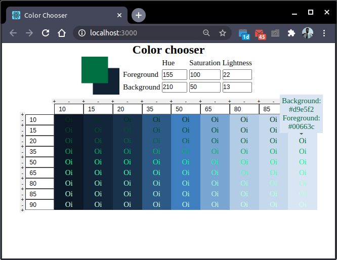

# Color Chooser

Este aplicativo, criado com `create react app` utilizando `yarn` e `typescript`,
vem para facilitar a escolha de cores por designers ou desenvolvedores front-end
que não contem com um designer em seu time. Com o color chooser você pode escolher
duas cores, uma para o fundo (Background) e outra para o texto (Foreground) e visualizar em uma tabela como o texto ficaria com aquelas cores. Uma vez criada
a tabela você poderá alterar a luminosidade (lightness) de ambas as cores, background
pelo valor na coluna e foreground pelo valor na linha. Desta forma você poderá
partir das cores que você gostaria de usar no projeto, e realizar um ajuste fino
alterando apenas o quão claras ou escuras elas serão utilizadas. Por fim passe o
mouse sobre a célula e você verá o rgb de ambas as cores.

É possível ainda adicionar linhas para testar diferentes luminosidades do texto,
bem como colunas para testar diferentes luminosidades do fundo. Sempre que existir
pelo menos duas colunas será possível excluir uma coluna, assim como sempre que
existir pelo menos duas linhas será possível excluir uma linha. Sempre que uma nova
linha/coluna for adicionada entre duas pré-existentes, seu valor inicial será a
média das duas.

Um exemplo pode ser visto na figura:

